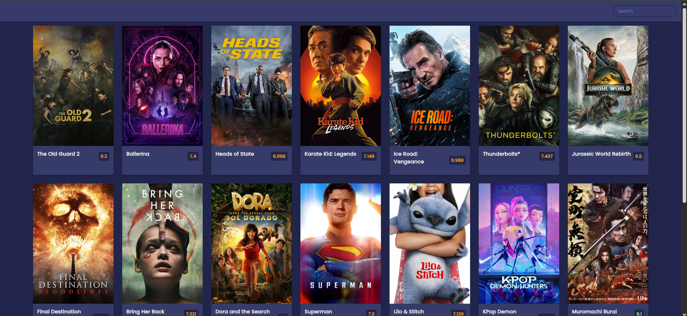

# 🎬 Movie Search Web App

A clean and responsive movie search application that fetches real-time data from [TMDb](https://www.themoviedb.org/). Instantly explore movie posters, ratings, and overviews in a sleek UI — built using only HTML, CSS, and JavaScript.



📺 **Watch Demo**: [YouTube Video](https://www.youtube.com/watch?v=gruYWaM-1tg)

---

## 🚀 Features

- 🔍 Real-time movie search via TMDb API
- 📊 Color-coded rating badges (green, orange, red)
- 🖼️ Poster and overview previews
- 📱 Fully responsive design
- ⚡ Smooth CSS transitions
- 💡 Built with plain JavaScript (no frameworks!)

---

## 🛠️ Tech Stack

- **HTML5**
- **CSS3**
- **JavaScript (ES6)**
- **TMDb API**

---

## 📦 Getting Started

### 1. Clone the repository
```bash
git clone https://github.com/taqitazwar/Movie-Search-Web-App.git
cd Movie-Search-Web-App
